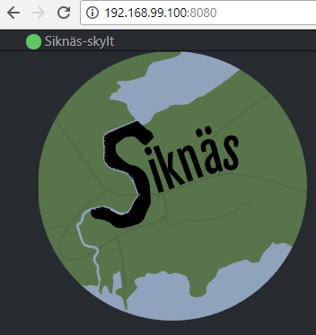
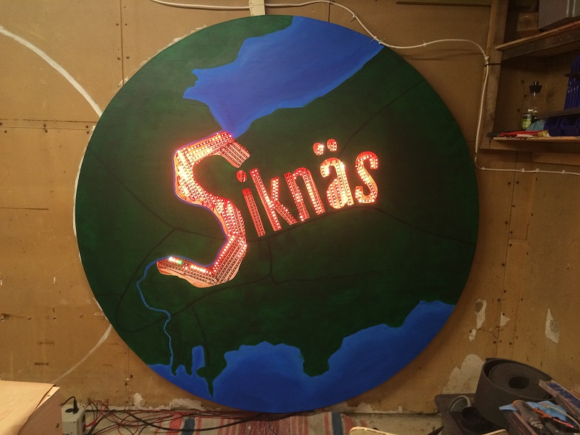
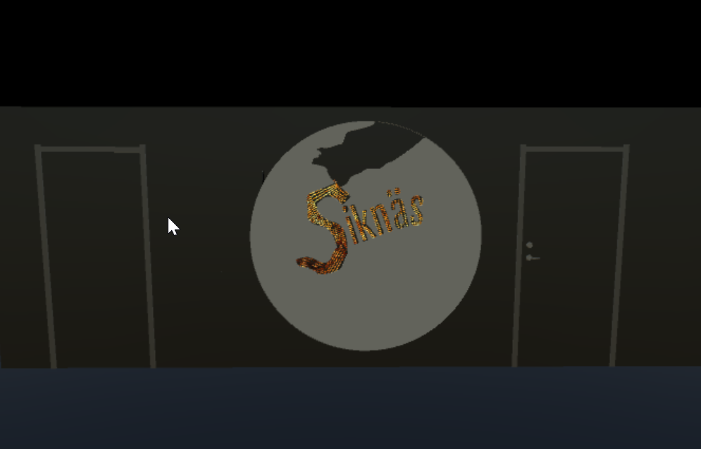
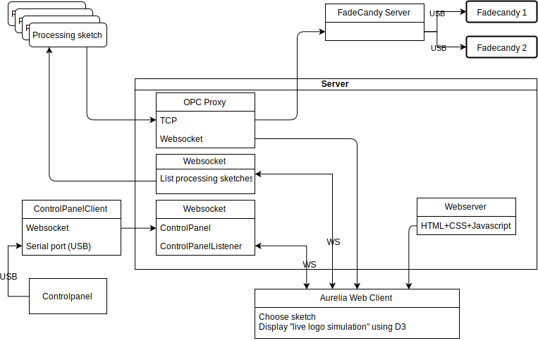

Siknas skylt
============

This repository contains code for running a custom interactive LED display, together with some helper tools.

The display uses the Fadecandy LED controller board https://github.com/scanlime/fadecandy that supports
the OpenPixelControl (OPC).

To use this software, a **Fadecandy** server needs to run and be connected to the display via **Fadecandy USB controller boards**.

Quickstart
----------

This quickstart uses **Docker**, see below on how to **build** a final build instead.

1. Install Docker. (On Windows use [**Docker toolbox**](https://docs.docker.com/toolbox/toolbox_install_windows/)).

2. Start the server. (On Windows run in the **Docker console**):

    ```bash
    docker-compose up -d
    docker logs -f server   # Depending what you want to follow.
    docker logs -f aurelia

    # Get error on starting aurelia?
    cd src/server/static/siknas-skylt/node_modules/
    rm -rf npm
    docker-compose up -d aurelia
    ```

3. Now you can surf to the server: http://localhost:8080 (Use `docker-machine ip` to get IP on Windows instead of `localhost`)
    ```bash
    start http://$(docker-machine ip):8080  # To open the webpage from the console on Windows.
    ```
    Which looks like this:

    

4. Download and install [**Processing**](https://processing.org/).

    Make sure the installation directory is added to the **Path** in Windows (Or write the full path in the examples below for `processing-java`).

5. Open the [**flames**](examples/flames/flames.pde) example sketch.

    **NOTE** If using the **Processing GUI** on Windows you must edit the `host` variable at the top of the sketch to connect to the `docker-machine ip` instead of `localhost`

    ```bash
    # Assuming you are standing in the root of this repository.
    processing-java --help

    # To run the example sketch (Note, must be the full path)
    processing-java --sketch=$(pwd)/examples/flames/ --run

    # On Windows you have to specify the OPC host to connect to since it is not localhost.
    processing-java --sketch=$(pwd)/examples/flames/ --run $(docker-machine ip):7890
    ```

6. Now if you don't have a real display built yet, you can test with the [**Simulator**](https://github.com/JoakimSoderberg/OPCSim). Download the latest version here: TODO

    Once you have the simulator running, you must configure the server so that it knows how to connect to it. To do this there's a [config file example](src/server/siknas.yaml.example).

    The server will look for this file in either the same path, or under `/etc/siknas/` on the system.

    So create a copy of it:

    ```bash
    cd src/server/
    cp siknas.yaml.example siknas.yaml
    cat siknas.yaml
    cd ../..
    ```

    Example contents:
    ```yaml
    opc-servers:
        simulator:
            host: 192.168.1.75
            port: 7890
    #processes:
    #    Flames:
    #        description: Cool flames
    #        Exec: /path/to/sketch/executable
    ```

    Edit this to connect to the correct ip. (On **Windows** this is your docker host IP, see `ipconfig`, on **Linux** most likely `localhost`).

    You can make the server forward the traffic both towards the real display, as well as the simualtor by adding a second entry in the config.

    Now restart the server to reload the config:

    ```bash
    docker-compose restart server
    ```

7. With the above steps, running **Processing** manually means we are not using the webserver to choose the animation. To enable that we can add a list of processes in the config file:

    ```yaml
    # ...
    processes:
        Flames:
            description: Cool flames
            Exec: /path/to/sketch/executable
    ```

    Since this will run inside of docker you'll need to export a Processing sketch


Building
--------

### Export Processing to be standalone

Examples assuming you are standing in the root of this repository (and using **git bash** or **docker console** on Windows).

To export a single Processing sketch to a standalone including an embedded **Java**:

**Windows**

```bash
# Add --no-java to not include Java (a lot smaller but you are responsible for Java to work).
processing-java --sketch=$(pwd)/examples/flames/ --platform=windows --output=animations/flames --export
```

**Linux**

```bash
# Note, running on Windows --no-java must be used.
processing-java --sketch=$(pwd)/examples/flames/ --platform=linux --output=$(pwd)/animations/flames --no-java --export

```


Display
-------

Example image of the real world display.



Simulator
---------

To enable development and testing animations on the display a simulator was created in [Unity](https://unity3d.com/):
https://github.com/JoakimSoderberg/OPCSim



Repository structure
--------------------

* [`docs`](docs/) - Contains some documentation on how the display works.
* [`examples/`](examples/) - Contains Processing sketches that animates the display using OPC.
* [`image-gui/`](image-gui/) - A .NET C# program used to map real pixel locations to the virtual ones. (Used to produce `layout.json` that the Processing sketches use).
* [`layouts`](layouts/) - Contains the [`layout.json`](layouts/layout.json) created by using the [`image-gui`](image-gui/), and the source image used to do this.
* [`scripts/`](scripts/) - A script to re-scale the coordinates in [`layout.json`](layouts/layout.json).
* [`src/controlpanel/`](src/controlpanel/) - A websocket client that talks to the control panel via a serial port over USB. The Websocket client connects to the server. Written in Golang.
* [`src/server/`](src/server/) - A server that hosts an OPC proxy, as well as a webserver and websockets server. This forwards the OPC traffic to the display coming from the processing sketches (that it starts and stops). It also broadcasts the traffic to connected webclients via websockets. The webserver hosts a web page that will let the user chose which processing sketch to run.
* [`src/server/static/`](src/server/static/) - Hosts a webpage written in [Aurelia](https://aurelia.io/) that displays the list of Processing sketches used to animate the display. This webpage also listens to the binary OPC traffic, and uses [D3](https://d3js.org/) to animate an SVG copy of the real display.

System overview
---------------



